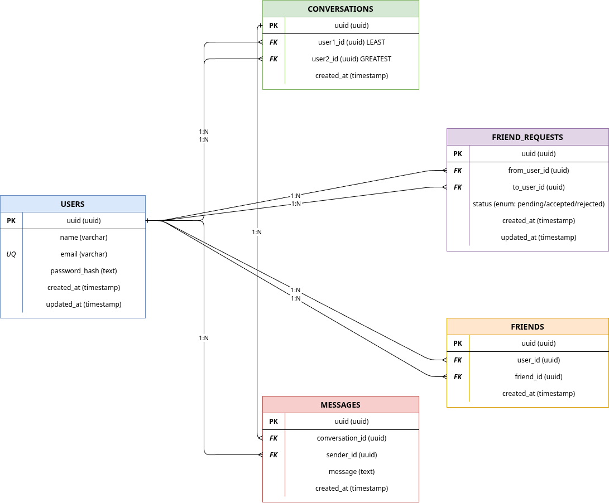

# Documentation

## API Reference
- [API Docs](./api/chitchat-documentation.html)

## ERD

## Tech Stack

### Backend
- Rust + Axum
- PostgreSQL
- Redis
- WebSocket

### Frontend
- React + Vite
- WebSocket client

## Environment Variables

### Backend
| Variable | Description |
|---|---|
| `DATABASE_URL` | PostgreSQL connection string |
| `REDIS_URL` | Redis connection string |
| `JWT_SECRET` | JWT signing secret |
| `API_SECRET` | API secret key |

### Frontend
| Variable | Description |
|---|---|
| `VITE_API_URL` | Backend URL (kosong untuk dev) |
| `VITE_WS_URL` | WebSocket URL (kosong untuk dev) |
| `VITE_API_SECRET` | API secret key |
